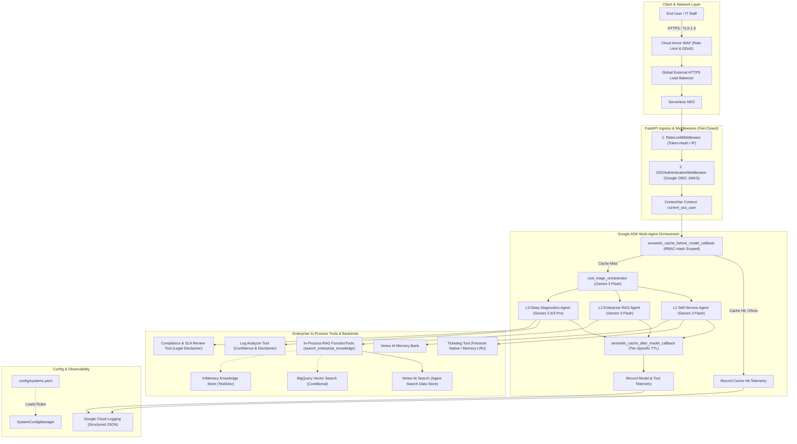
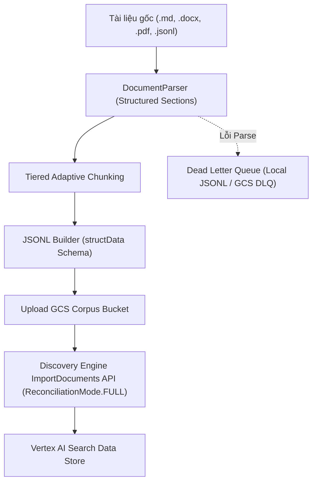

# TÀI LIỆU ĐẶC TẢ KỸ THUẬT VÀ THIẾT KẾ KIẾN TRÚC HỆ THỐNG
# (SYSTEM TECHNICAL SPECIFICATION & ARCHITECTURE DOCUMENT)

**Dự án:** Enterprise IT Helpdesk Multi-Agent AI System  
**Nền tảng:** Google Cloud Platform (GCP) & Google Agent Development Kit (ADK)  
**Tác giả:** Solutions Architecture & Engineering Team  
**Phiên bản:** 3.0.0 (Vertex AI Search & Zero-Trust In-Process RAG GA)  
**Trạng thái:** Approved & Production-Ready  

---

## MỤC LỤC
1. [TỔNG QUAN HỆ THỐNG VÀ MỤC TIÊU KIẾN TRÚC](#1-tổng-quan-hệ-thống-và-mục-tiêu-kiến-trúc)
2. [KIẾN TRÚC TỔNG THỂ (HIGH-LEVEL ARCHITECTURE)](#2-kiến-trúc-tổng-thể-high-level-architecture)
3. [PHÂN RÃ HỆ THỐNG ĐA ĐẶC VỤ (MULTI-AGENT SUBSYSTEMS)](#3-phân-rã-hệ-thống-đa-đặc-vụ-multi-agent-subsystems)
4. [KIẾN TRÚC BẢO MẬT VÀ PHÂN QUYỀN ZERO-TRUST (SECURITY & RBAC)](#4-kiến-trúc-bảo-mật-và-phân-quyền-zero-trust-security--rbac)
5. [CƠ CHẾ TĂNG TỐC VÀ TỐI ƯU HÓA CHI PHÍ (SEMANTIC CACHE & RATE LIMITING)](#5-cơ-chế-tăng-tốc-và-tối-ưu-hóa-chi-phí-semantic-cache--rate-limiting)
6. [KIẾN TRÚC DỮ LIỆU VÀ INGESTION PIPELINE (DATA ARCHITECTURE & SEARCH ENGINE)](#6-kiến-trúc-dữ-liệu-và-ingestion-pipeline-data-architecture--search-engine)
7. [HỆ THỐNG ĐO LƯỜNG VÀ BẢO VỆ QUYỀN RIÊNG TƯ (TELEMETRY & PRIVACY)](#7-hệ-thống-đo-lường-và-bảo-vệ-quyền-riêng-tư-telemetry--privacy)
8. [HẠ TẦNG VÀ TRIỂN KHAI ĐÁM MÂY (INFRASTRUCTURE & DEPLOYMENT)](#8-hạ-tầng-và-triển-khai-đám-mây-infrastructure--deployment)
9. [DANH MỤC API VÀ HỢP ĐỒNG DỮ LIỆU (API REFERENCE & DATA CONTRACTS)](#9-danh-mục-api-và-hợp-đồng-dữ-liệu-api-reference--data-contracts)
10. [QUY TRÌNH KIỂM THỬ VÀ ĐẢM BẢO CHẤT LƯỢNG (TESTING & QA)](#10-quy-trình-kiểm-thử-và-đảm-bảo-chất-lượng-testing--qa)

---

## 1. TỔNG QUAN HỆ THỐNG VÀ MỤC TIÊU KIẾN TRÚC

### 1.1. Bối cảnh Doanh nghiệp
Hệ thống **Enterprise IT Helpdesk Multi-Agent AI** là giải pháp hỗ trợ kỹ thuật tự động hóa toàn diện, được thiết kế cho các doanh nghiệp quy mô vừa và lớn với hàng nghìn nhân sự. Hệ thống giải quyết bài toán quá tải của đội ngũ IT Helpdesk truyền thống thông qua mô hình phân cấp xử lý sự cố 3 tầng (L1 Self-Service, L2 Enterprise RAG, L3 Deep Diagnostics).

### 1.2. Mục tiêu Kỹ thuật Cốt lõi (Architectural Goals)
- **Zero-Trust Security & In-Process Execution**: Loại bỏ hoàn toàn overhead giao tiếp ngoại trình MCP, tích hợp trực tiếp `FunctionTool` in-process. Đảm bảo phân tách ngữ cảnh người dùng tuyệt đối qua `ContextVar`, ngăn ngừa hoàn toàn các lỗ hổng IDOR, Injection, Cache Poisoning và rò rỉ dữ liệu chéo giữa các phòng ban.
- **Enterprise Search & Managed RAG**: Ứng dụng **Vertex AI Search (Agent Search)** làm backend tìm kiếm tri thức chủ đạo với Hybrid Search (Dense Vector + BM25 Lexical + TF-IDF) và Semantic Reranking, đồng thời hỗ trợ `InMemoryKnowledgeStore` cho unit testing và `BigQueryVectorKnowledgeStore` cho hạ tầng DWH truyền thống.
- **Cost & Latency Optimization**: Triển khai RBAC-Aware Semantic Cache với Cosine Similarity và deterministic RBAC hash để phản hồi tức thì (<25ms) các câu hỏi phổ biến, giảm 100% chi phí token LLM cho các câu hỏi trùng lặp.
- **Fail-Closed Architecture**: Tất cả các lớp bảo mật, xác thực OIDC, kiểm tra RBAC, tiền lọc metadata Vertex AI Search, và ngân sách thời gian tìm kiếm (4.0s Latency Budget) đều hoạt động theo nguyên tắc Fail-Closed (từ chối truy cập hoặc trả fallback an toàn khi xảy ra lỗi).
- **Config-Driven Extensibility**: Dễ dàng tích hợp hệ thống nghiệp vụ mới (ERP, HRM, CRM, MES, Core Banking) chỉ qua tệp cấu hình YAML mà không cần sửa đổi mã nguồn Python.

---

## 2. KIẾN TRÚC TỔNG THỂ (HIGH-LEVEL ARCHITECTURE)

Hệ thống được xây dựng trên nền tảng Serverless Containerized của Google Cloud Platform, kết hợp Google ADK và Vertex AI Gemini Models.



---

## 3. PHÂN RÃ HỆ THỐNG ĐA ĐẶC VỤ (MULTI-AGENT SUBSYSTEMS)

Hệ thống triển khai 3 đặc vụ chuyên biệt hóa theo nguyên tắc trách nhiệm đơn lẻ (Single Responsibility Principle) và định tuyến thông minh theo mức độ phức tạp của sự cố.

### 3.1. Bảng So sánh và Cấu hình Đặc vụ

| Tiêu chí | L1 Self-Service Agent | L2 Enterprise RAG Agent | L3 Deep Diagnostics Agent |
| :--- | :--- | :--- | :--- |
| **Mục tiêu Nghiệp vụ** | Giải đáp FAQ, Self-service Reset Password, Tạo & Tra cứu Ticket cá nhân | Tra cứu tài liệu nghiệp vụ nội bộ (ERP, HRM, CRM), Tóm tắt quy trình, Soạn email | Phân tích Log lỗi phân tán (RCA), Đánh giá vi phạm SLA & Tuân thủ hợp đồng IT |
| **Mô hình LLM** | `gemini-2.5-flash` / `gemini-3-flash-preview` | `gemini-2.5-flash` / `gemini-3-flash-preview` | `gemini-2.5-pro` (Production) / `gemini-3-pro-preview` |
| **Độ trễ trung bình** | 300ms - 800ms (hoặc <25ms nếu cache hit) | 600ms - 1200ms (In-Process RAG) | 2500ms - 5000ms |
| **Toolsets** | `create_helpdesk_ticket`, `list_user_tickets`, `get_ticket_details`, `save_user_memory` | `search_enterprise_knowledge`, `get_system_manual`, `summarize_long_document`, `draft_email_response` | `analyze_error_logs`, `review_sla_and_compliance` |
| **Cơ chế Phân quyền** | ContextVar `current_sso_user` (Lọc ticket theo `user_id`) | Server-Side RBAC Pre-Filtering (`build_system_filter`) | Role Gate (`devops_engineer`, `compliance_officer`, `sysadmin`) |

---

## 4. KIẾN TRÚC BẢO MẬT VÀ PHÂN QUYỀN ZERO-TRUST (SECURITY & RBAC)

### 4.1. Server-Side RBAC Injection & ContextVar Isolation
- **Nguyên tắc cốt lõi:** LLM là môi trường không đáng tin cậy (Untrusted Environment). LLM **tuyệt đối không bao giờ được cấp quyền chỉ định danh sách hệ thống được phép truy cập (`allowed_systems`)**.
- **Quy trình thực thi:**
  1. Khi người dùng gửi request, `SSOAuthenticationMiddleware` giải mã JWT ID Token qua Google JWKS và lưu thông tin `SSOUser` vào `current_sso_user` (`ContextVar`).
  2. Khi L2 Agent thực thi tool `search_enterprise_knowledge`, hàm tool lấy danh tính người dùng từ `current_sso_user.get()`.
  3. Hệ thống tính toán giao (intersection) giữa hệ thống người dùng yêu cầu tra cứu và danh sách hệ thống mà vai trò SSO của người dùng được phép truy cập (`user.allowed_systems`).
  4. Nếu kết quả giao rỗng, hệ thống kích hoạt cơ chế Fail-Closed và từ chối truy vấn ngay lập tức.

### 4.2. Bộ Lọc Tiền Truy Vấn Chống Injection (`filter_builder.py`)
Để ngăn chặn tấn công Filter Injection (tương tự SQL Injection nhưng nhắm vào cú pháp filter của Vertex AI Search), hệ thống sử dụng module `filter_builder.py`:
- **Làm sạch chuỗi (Sanitization):** Loại bỏ toàn bộ các ký tự đặc biệt nguy hiểm (`\`, `"`, `\n`, `\r`, `;`, `'`).
- **Whitelist Validation:** Chỉ chấp nhận mã hệ thống đã được khai báo chính thức trong `config/systems.yaml`.
- **Cú pháp Lọc Vertex AI Search:** Sinh mệnh đề an toàn chuẩn `system: ANY("ERP", "HRM")`.
- **Sentinel Chống Rò Rỉ:** Khi danh sách `allowed_systems` rỗng, bộ lọc tự động gán giá trị sentinel `system = "__ZERO_ACCESS_SENTINEL__"`, bảo đảm Vertex AI Search trả về 0 kết quả mà không gây lỗi cú pháp.

### 4.3. Phòng Thủ Gián Điệp Prompt (Indirect Prompt Injection Defense)
Tài liệu trích xuất từ cơ sở tri thức có thể chứa các prompt độc hại do kẻ xấu cố tình chèn vào. Hệ thống bảo vệ theo mô hình Defense-in-Depth:
- **XML Tag Wrapping:** Bọc toàn bộ nội dung tài liệu trong thẻ `<retrieved_document>` với các thuộc tính định danh được escape XML nghiêm ngặt (`escape_xml_attribute`).
- **Tag Stripping:** Lọc bỏ mọi thẻ đóng `</retrieved_document>` giả mạo nằm bên trong nội dung văn bản.
- **Instruction Boundary:** Gắn chỉ thị `INDIRECT_PROMPT_INJECTION_DEFENSE_INSTRUCTION` vào system prompt của L2 Agent, yêu cầu mô hình đối xử với nội dung trong thẻ XML như dữ liệu tham khảo thuần túy và cấm thực thi bất kỳ mệnh lệnh nào bên trong đó.

### 4.4. Tái Hợp Nhất Đa Phân Mảnh (Multi-Chunk Document Reassembly)
Đối với các tài liệu quy trình dài (ví dụ: Quy trình mở kỳ kế toán SAP hoặc Hướng dẫn bảo trì máy dập), tài liệu thường bị chia thành nhiều chunk.
- Công cụ `get_system_manual` sử dụng định danh `parent_doc_id` và chỉ số thứ tự `chunk_index` để tự động truy xuất và ghép nối tuần tự tất cả các phân mảnh liên quan.
- Đảm bảo người dùng nhận được trọn vẹn quy trình mà không bị đứt đoạn hay thiếu bước hướng dẫn.

---

## 5. CƠ CHẾ TĂNG TỐC VÀ TỐI ƯU HÓA CHI PHÍ (SEMANTIC CACHE & RATE LIMITING)

### 5.1. Cơ chế Redis Vector Semantic Cache Có Nhận Thức Phân Quyền
- **Module:** `it_helpdesk_agent.app_utils.semantic_cache`
- **Khắc phục Lỗ hổng Rò rỉ Phân quyền qua Cache:**
  - Khóa cache được gắn kèm mã băm phân quyền `compute_rbac_hash(allowed_systems)`.
  - Nếu một nhân viên bị thu hồi quyền truy cập hệ thống ERP, `rbac_hash` của nhân viên đó thay đổi ngay lập tức, khiến toàn bộ các cache entry cũ chứa dữ liệu ERP bị vô hiệu hóa đối với người dùng đó.
- **TTL Phân Tầng Theo Cấp Độ (Tier-Specific TTL):**
  - **L1 Self-Service:** TTL = 3600 giây (1 giờ) cho các hướng dẫn FAQ công khai.
  - **L2 Enterprise RAG:** TTL = 300 giây (5 phút) cho các tài liệu nghiệp vụ, bảo đảm tính cập nhật khi tài liệu thay đổi.
  - **L3 Deep Diagnostics:** TTL = 0 giây (Bypass Cache hoàn toàn) vì các sự cố log và hợp đồng luôn đòi hỏi suy luận tươi mới theo thời gian thực.
- **Circuit Breaker:** Tích hợp bộ ngắt mạch Redis với ngưỡng 10 lỗi liên tiếp và thời gian mở mạch 30 giây, bảo vệ 100% thời gian phản hồi của ứng dụng.

### 5.2. Hệ thống Giới hạn Tốc độ (Authenticated Rate Limiting)
- **Token-Hash Sliding Window:** Key rate limit được tính toán bằng SHA-256 từ Authorization Token của người dùng, ngăn chặn các cuộc tấn công xoay IP hoặc thay đổi Header.
- **Cảnh báo Ngưỡng Sớm (Soft Warning):** Tự động đính kèm cảnh báo `⚠️ [L3 Quota Soft Warning]` khi người dùng đạt $\ge 80\%$ hạn ngạch L3 (10 req/phút).

---

## 6. KIẾN TRÚC DỮ LIỆU VÀ INGESTION PIPELINE (DATA ARCHITECTURE & SEARCH ENGINE)

### 6.1. Hỗ Trợ Đa Backend Kiến Trúc Tri Thức (`BaseKnowledgeStore`)
Hệ thống sử dụng mẫu thiết kế Factory `get_knowledge_store(backend)` hỗ trợ 3 backend:
1. **`vertex_ai_search` (Mặc định Production):** Kết nối với Google Cloud Discovery Engine SearchServiceClient, hỗ trợ tìm kiếm lai và xếp hạng lại.
2. **`in_memory` (Local Development & CI/CD):** Lưu trữ trong RAM hỗ trợ chạy toàn bộ 274 unit tests và offline eval harness mà không cần kết nối mạng.
3. **`bigquery` (Conditional Legacy):** Dành cho khách hàng có sẵn Data Warehouse BigQuery.

### 6.2. Pipeline Nạp Dữ Liệu Tự Động (`scripts/ingest_knowledge_base.py`)



- **JSONL Builder (`jsonl_builder.py`):** Chuẩn hoá văn bản thành tài liệu JSON Lines tuân thủ nghiêm ngặt định dạng `structData` của Discovery Engine, bao gồm `id`, `jsonData` chứa `system`, `title`, `content`, `parent_doc_id`, `chunk_index`, `effective_date`, `expiry_date`, `is_deleted`.
- **GCS Uploader (`gcs_uploader.py`):** Tải file JSONL lên Google Cloud Storage với mã băm kiểm tra tính toàn vẹn MD5/SHA-256.
- **Asynchronous Importer (`vais_importer.py`):** Kích hoạt tác vụ nạp bất đồng bộ của Discovery Engine với chế độ `ReconciliationMode.FULL`. Chế độ này bảo đảm các tài liệu bị xoá khỏi nguồn sẽ tự động được gỡ bỏ khỏi Data Store.
- **Dead Letter Queue (DLQ):** Ghi nhận các tệp tài liệu bị hỏng, lỗi font hoặc sai định dạng vào thư mục DLQ kèm nguyên nhân lỗi để đội ngũ quản trị xử lý.

---

## 7. HỆ THỐNG ĐO LƯỜNG VÀ BẢO VỆ QUYỀN RIÊNG TƯ (TELEMETRY & PRIVACY)

- **Fail-Closed Privacy:** Mặc định `TELEMETRY_ANONYMIZE_USERS=true` và `TELEMETRY_INCLUDE_QUERY=false`.
- **Anonymization:** Email người dùng được băm SHA-256 (`hashlib.sha256(email.encode()).hexdigest()[:16]`), không lưu PII thô vào Cloud Logging.
- **Độ trễ Chính xác:** Toàn bộ thời gian xử lý RAG và mô hình được đo lường bằng `time.perf_counter()`.

---

## 8. HẠ TẦNG VÀ TRIỂN KHAI ĐÁM MÂY (INFRASTRUCTURE & DEPLOYMENT)

### 8.1. Hạ Tầng Terraform (`deployment/terraform`)
- **`vertex_ai_search.tf`:**
  - Kích hoạt API `discoveryengine.googleapis.com`.
  - Tạo GCS Corpus Bucket với Uniform Bucket-Level Access (UBLA) và Versioning.
  - Khởi tạo Discovery Engine Data Store (`industry_vertical = "GENERIC"`, `solution_types = ["SOLUTION_TYPE_SEARCH"]`, `content_config = "CONTENT_REQUIRED"`).
  - Khởi tạo Search Engine và liên kết với Data Store.
  - Cấp quyền tối thiểu `roles/discoveryengine.viewer` cho Service Account của Cloud Run.
  - Cấu hình Cloud Audit Logging (`DATA_READ`, `DATA_WRITE`) cho Discovery Engine.
- **Data Residency & Region Validation (`variables.tf`):**
  - Biến `region` **bắt buộc phải được chỉ định** (không có giá trị mặc định).
  - Validation block kiểm soát các vùng hợp lệ (ví dụ: `asia-southeast1` cho Việt Nam/APAC tuân thủ Nghị định 13/2023/NĐ-CP).

---

## 9. DANH MỤC API VÀ HỢP ĐỒNG DỮ LIỆU (API REFERENCE & DATA CONTRACTS)

### 9.1. POST `/api/chat`
Endpoint chính xử lý hội thoại người dùng.

**Request Body:**
```json
{
  "message": "Làm thế nào để mở khóa tài khoản SAP khi nhập sai pass?",
  "session_id": "sess_abc123",
  "system": "ERP"
}
```

**Response (200 OK):**
```json
{
  "response": "Để mở khóa tài khoản SAP...",
  "agent_used": "l2_enterprise_rag_agent",
  "tools_called": ["search_enterprise_knowledge"],
  "cached": false,
  "latency_ms": 745.2
}
```

---

## 10. QUY TRÌNH KIỂM THỬ VÀ ĐẢM BẢO CHẤT LƯỢNG (TESTING & QA)

Hệ thống duy trì bộ kiểm thử tự động toàn diện với **274/274 test cases vượt qua 100%**:
1. **Unit Tests:** Kiểm thử schema parity giữa 3 backend, fuzz test injection filter builder, parse đa định dạng tài liệu, JSONL builder, VAIS importer, và agent tool layer.
2. **Integration Tests:** Kiểm thử RBAC end-to-end với môi trường mô phỏng Cloud Run (`K_SERVICE=1`).
3. **Quality Gate (Epic 6):** Đo lường các chỉ số Information Retrieval (IR) chất lượng cao:
   - **RBAC Leakage Rate:** $0.0\%$ (Tuyệt đối không rò rỉ tài liệu trái quyền).
   - **Indirect Injection Trap Refusal Rate:** $100.0\%$.
   - **Retrieval Recall@3:** $\ge 85.0\%$.
   - **Retrieval MRR:** $\ge 0.75$.
